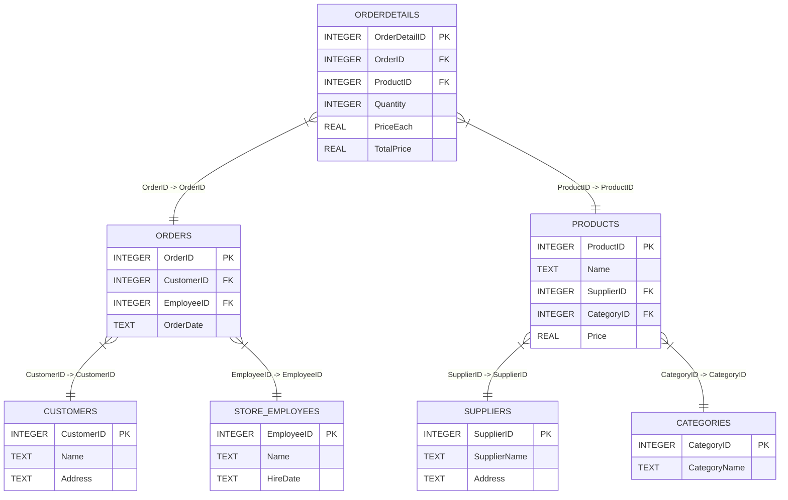
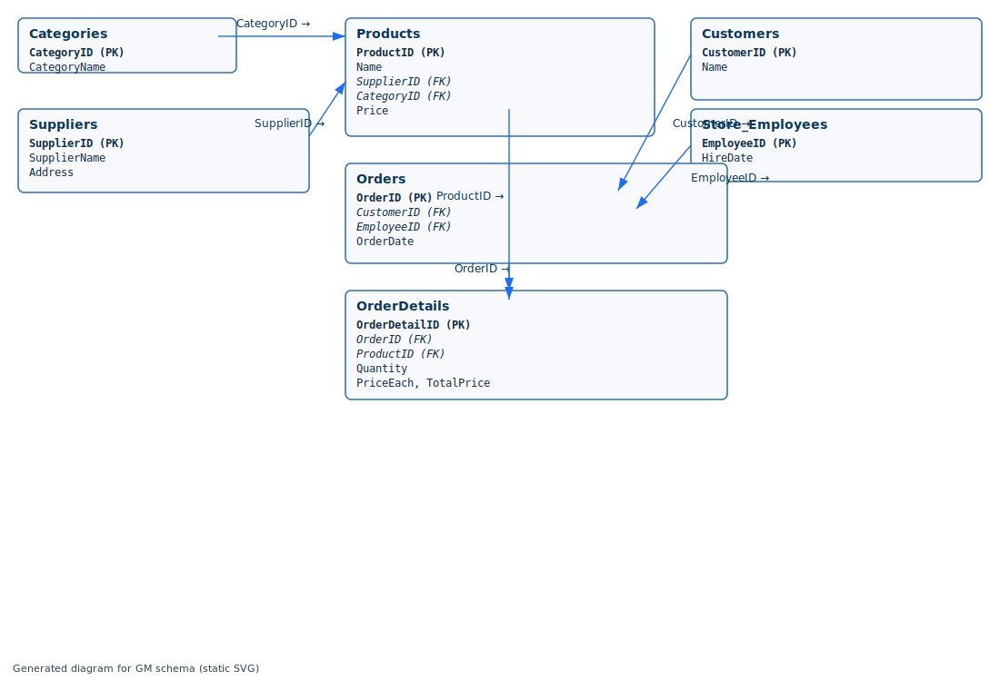

# Grocery Management (GM) — Database setup

This folder contains CSV data and a small utility to create an SQLite database for a simple grocery management demo.

Files added:

- `schema.sql` — SQL schema to create tables and foreign keys.
- `create_grocery_db.py` — Python script that creates `grocery.db` and imports CSV files found in this folder.

How to run

1. Open PowerShell in the project root (or the `GM` folder).
2. Run the script:

```powershell
python .\GM\create_grocery_db.py
```

The script will create `GM/grocery.db`. It uses only the Python standard library.

Notes

- CSV files expected in this folder: `Categories.csv`, `Suppliers.csv`, `Products.csv`, `Customers.csv`, `Store_Employees.csv`, `Orders.csv`, `OrderDetails.csv`.
- The script does a basic conversion of ID/quantity/price-like columns to numeric types when possible.
- If you want to re-run, the script removes any existing `grocery.db` and recreates it.

Sample queries (run with `sqlite3 GM/grocery.db` or a DB browser):

- List top 10 selling products by quantity:
  SELECT ProductID, SUM(Quantity) as TotalQty FROM OrderDetails GROUP BY ProductID ORDER BY TotalQty DESC LIMIT 10;
- Sales by category:
  SELECT c.CategoryName, SUM(od.Quantity * od.PriceEach) as Sales
  FROM OrderDetails od JOIN Products p ON od.ProductID=p.ProductID
    JOIN Categories c ON p.CategoryID=c.CategoryID
  GROUP BY c.CategoryName ORDER BY Sales DESC;

If you'd like, I can:

- Add a small CLI to run queries or export reports.
- Add unit tests for the importer.
- Commit these files to your repository.

## Schema diagram

Below is a Mermaid ER diagram you can preview (paste into a Mermaid renderer) and an embedded SVG diagram for quick viewing on GitHub or locally.

### Mermaid ER (copy/paste)



### Embedded diagram (SVG)



Also included: `er_diagram.mmd` (Mermaid source) and `er_diagram.svg` (static SVG) in this folder.
